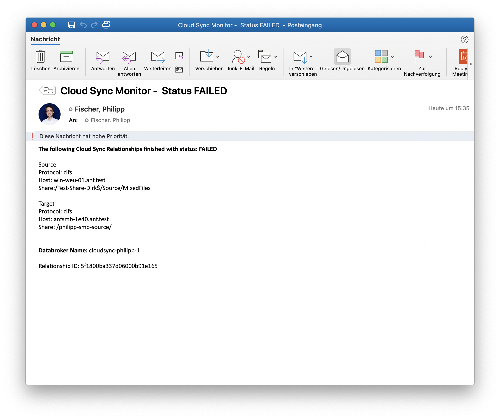
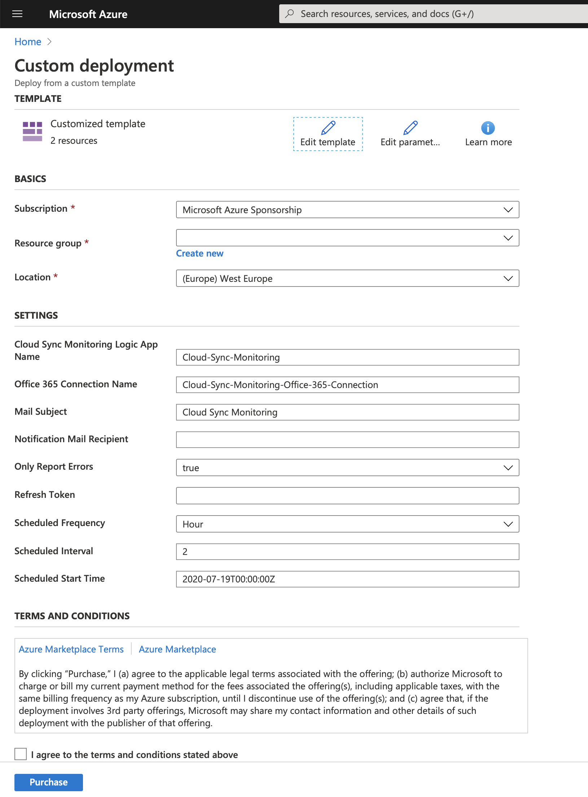
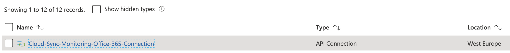
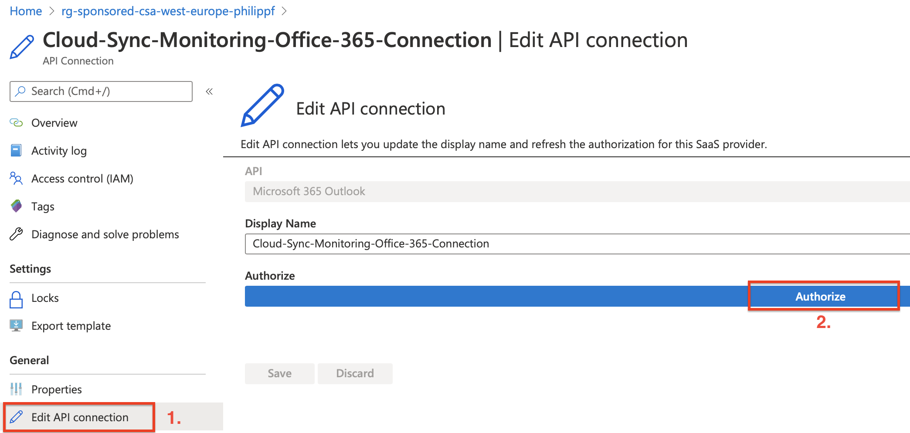
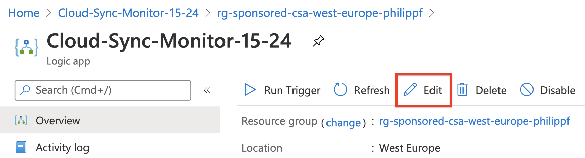
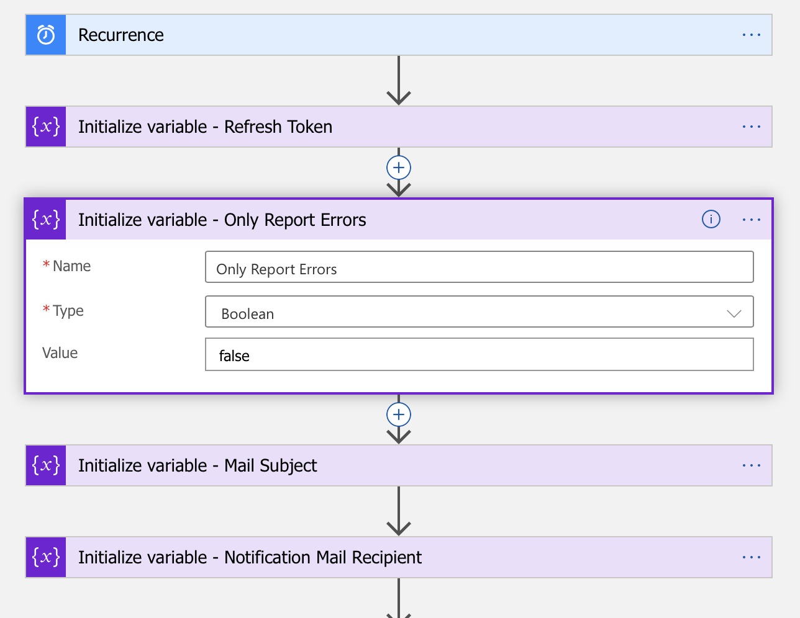

# NetApp Cloud Sync Monitor

Created by Philipp Fischer (Cloud Solutions Architect for Azure NetApp Files at NetApp)

This is a basic Azure Logic App to monitor NetApp Cloud Sync relationships and get notified via mail either only on failures or on failures as well as successfull syncs.

## Introduction
This Cloud Sync Monitor offers the following funcionality:
- Send notification mails for failed (and optionally also successful) sync relationships.
- This is a pull monitor, no events are pushed from Cloud Sync to it.
- The monitoring interval is freely configurable in minutes, hours, days or weeks. 
- Cloud Sync Monitor always sends one mail per successful or failed sync relationship for the configured interval setting.

The notifications that are sent look like this:

Deployment is really simple: Deploy the Logic App via the "Deploy to Azure" button below and specify the necessary parameters, one of which is the Cloud Central Refresh Token (see instructions for this in the [Prerequisites](#Prerequisites) section).
Although most likely not needed, you can find a detailed description of every parameter and the exact deployment steps below.

#### The template deploys two components: 
- The Azure Logic App containing the monitoring logic
- An Office / Microsoft 365 API connection, which is used to connect to your mail account to send the notification mails

## Prerequisites
### Cloud Central Refresh Token
The Azure Logic App uses a refresh token provided through NetApp Cloud Central, which in turn is used to generate an access token for accessing the API services for Cloud Sync.
To generate a refresh token follow these steps:

1. Go to https://services.cloud.netapp.com/refresh-token
2. Sign in with the same user account and passwort used for accessing NetApp Cloud Sync.
3. Generate a refresh token and copy or save it somewhere. This will be needed during the Logic App deployment

Some remarks on the refresh token:
- This single token can be reused multiple times when re-deploying the Logic App or also when creating multiple Logic App instances.
- If necessary you can also revoke the token and create a new one via the aforementioned link.

### Microsoft (Office) 365 Account
You will need an Office / Microsoft 365 Account that will be used to send the notification mails. Authentication to your account is securely handled by an Azure API connection to Office 365 that is created automatically during Logic App deployment. However, this is currently the only option to send notification mails.
If you don't have an Office 365 account, feel free to reach out in order to evaluate other mail providers as well.

## Deployment & Configuration
### Deployment

All you need to do is to click the "Deploy to Azure" button below, which then takes you right to the Azure Portal to specify the necessary parameters for deployment.

After launching the template you are presented with an Azure custom deployment screen that asks for some configuration details:

The following Cloud Sync Monitor specific parameters need to be specified and you can either accept the default values or modify them according to your needs:
- Cloud Sync Monitor Name
    - This is the name for the Azure Logic App resource.
- Office 365 Connection Name
    - This is the Azure resource name for the Office 365 Connection that is being used for sending the notification mails. The connection has to be configured separately after deployment (see detailed steps [below](#Configuration)).
- Mail Subject
    - The chosen mail subject is always appended by the job status, which is either "Failed" or "Done".
- Notification Mail Recipient
    - You can specify multiple addresses by using the semicolon as delimiter.
- Only Report Errors (true/false)
    - If set to *true* you will only be notified about failed sync relationships. If set to *false* you will get a notification for every successful sync as well. You will always receive one mail per sync relationship.
    - This parameter could be set to *false* for initial testing and afterwards be changed to *true* (see instructions [below](#Change-Settings-after-Deployment)).
- Refresh Token
    - This is the refresh token generated in the [prerequisites section](#Cloud-Central-Refresh-Token)
- Scheduled Frequency
    - When do you want the Monitor to check for sync relationship status updates (i.e: Minute, Hour, Day, Month)
- Scheduled Interval
    - How often should the Monitor be run in your previously specified frequency (i.e. every 5 minutes, every 5 hours ...)
- Scheduled Start Time
    - Usually there is no need to change this parameter unless you want the Montior to start running at some point in the future

### Configuration
After successfully deploying the Cloud Sync Monitor Logic App, the API connection for Office 365 needs to be connected to an Office 365 account.
1. This has to be configured within the Office 365 API connection resource that was deployed to the specified ressource group during deployment:

2. Select "Edit API connection".
3. Choose an Office 365 account to be used for sending the notification mails.

4. Click "Authorize".

## Change Settings after Deployment
It might be necessary to change some settings after the Cloud Sync Monitor Logic App has already been deployed. The following settings can be configured after deployment:
- Recurrence setting (interval / frequency)
- Refresh token
- The setting whether to only report errors or all successfull sync relationships as well
- Mail subject
- Notification mail recipient 

This can be done easily by changing the corresponding variables through the Azure Logic App Designer:
1. Select the Cloud Sync Monitor Azure Logic App in your resource group
2. Open the Logic App Designer by clicking "Edit"

3. Change one of the following variables within the Logic App Designer

4. Save and exit the Logic App Designer