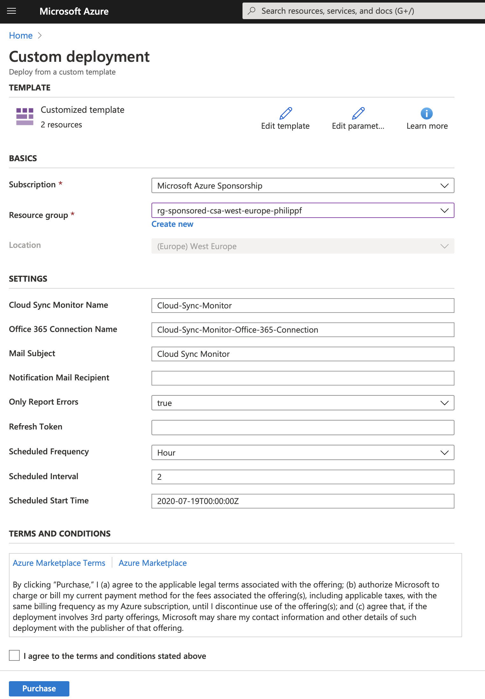

# NetApp Cloud Sync Monitor

Created by Philipp Fischer (Cloud Solutions Architect for Azure NetApp Files at NetApp)

This is a basic Azure Logic App to monitor NetApp Cloud Sync relationships and get notified via mail on either only on failures or on failures as well as successfull syncs.

## Introduction
This Cloud Sync monitor offers the following funcionality:
- Sends notification mails for failed (and optionally also successful) sync relationships.
- This is a pull monitor, no events are pushed from Cloud Sync to it.
- The monitoring interval is freely configurable in minutes, hours, days or weeks. 
- The Cloud Sync Monitor always sends one mail per successful or failed sync relationship for the configured interval setting.

The notifications that are sent look like this:

#### The template deploys two components:
- The Azure Logic App containing the monitoring logic
- An Office / Microsoft 365 API connection, which is used to connect to your mail account to send the notification mails

## Prerequisites
### Cloud Central Refresh Token
The Azure Logic uses a refresh token provided through NetApp Cloud Central, which in turn is used to generate an access token for accessing the API Services for Cloud Sync.
To generate a refresh token follow the below steps:

- Go to https://services.cloud.netapp.com/refresh-token, generate a refresh token and copy or save it somewhere. This will be needed during the Logic App Deployment
- This token can be reused multiple times when re-deploying the Logic App or also when creating multiple Logic App instances.
- If necessary you can also revoke the token and create a new one via the aforementioned link.

### Microsoft (Office) 365 Account
You will need an Office / Microsoft 365 Account that will be used to send the notification mails. Authentication to your account is securely handled by an Azure API connection to Office 365 that is created automatically during Logic App deployment. However, this is currently the only option to send notification mails.
If you don't have an Office 365 account, feel free to reach out in order to evaluate other mail providers as well.

## Deployment & Configuration
### Deployment

All you need to do is to click the "Deploy to Azure" button below, which then takes you right to the Azure Portal to specify the necessary parameters for deployment (see below).

### Configuration
After launching the template you are presented with an Azure custom deployment screen that asks for some configuration details:

The following parameters need to be specified and you can either accept the default values or modify them according to your needs:
- Basic Azure deployment information (Subscription, Resource Group, Location)
- Cloud Sync Monitor Name
    - This is the name for the Azure Logic App resource.
- Office 365 Connection Name
    - This is the Azure resource name for the Office 365 Connection that is being used for sending the notification mail. This has to be configured separately after deployment. (See detailed steps below)
- Mail Subject
    - The chosen mail subject is always appended by the job status, which is either "Failed" or "Done".
- Notification Mail Recipient
    - You can specify multiple addresses with a semicolon.
- Only Report Errors (true/false)
    - If set to true you will only be notified on failed sync relationships. If set this to false you will get a notification for every successful sync as well. You will always receive one mail per sync relationship.
    - This parameter could be set to "false" for initial testing and afterwards changed to "true" (see instructions below).
- Refresh Token
    - This is the refresh token generated before
- Scheduled Frequency
    - When do you want the Monitor to check for sync relationship stattus updated i.e: Minute, Hour, Day, Month)
- Scheduled Interval
    - How often should the Monitor be run in your previously specified frequency (i.e. every 5 minutes, every 5 hours ...)
- Scheduled Start Time
    - Usually there is no need to change this parameter unless you want the Montior to start running at some point in the future

Hinweis auf: Wenn es aktuell keine Failed relationships gibt, dann zum Testen auf false stellen und anschließend ändern